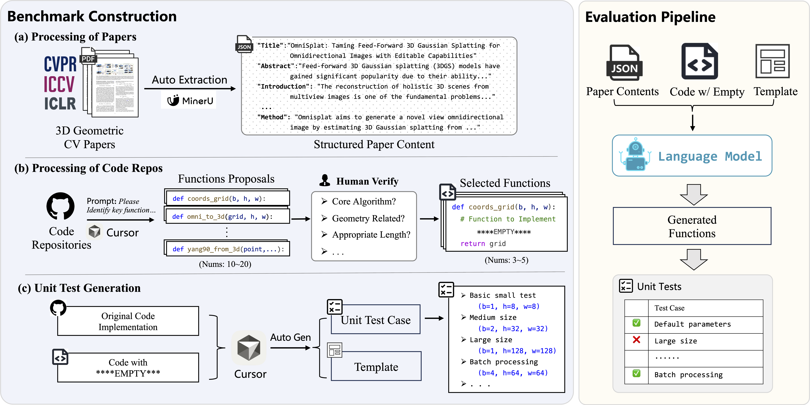

# GeoCodeBench

[](https://arxiv.org/abs/2603.30038) [](https://geocodebench.github.io/)

[CVPR 2026] Benchmarking PhD-Level Coding in 3D Geometric Computer Vision

## Overview

GeoCodeBench is the first PhD-level benchmark designed to evaluate the capability of LLMs to understand and implement complex 3D geometric vision code from scientific paper. Each problem is a fill-in-the-function implementation task curated from representative papers at recent top-tier venues. To solve these tasks, LLMs are provided with the structured full paper content, the partially masked source code, and a standardized execution template. Performance is measured via diverse, edge-case unit tests.





The benchmark organizes coding tasks into a two-level capability hierarchy:

- **General 3D Capability**: Evaluates foundational geometric reasoning, including Geometric Transformations (e.g., coordinate conversions, projections) and Mechanics/Optics Formulation (e.g., radiometric operators, differentiable equations).
- **Research Capability**: Evaluates higher-level procedural reasoning, including Novel Algorithm Implementation (translating mathematical principles into code) and Geometric Logic Routing (composing existing operators into complete pipelines).


## Repository Structure

```text
.
├── GeoCodeBench/                              # all benchmark tasks
│   ├── NN_ShortName/                          # one directory per paper / task
│   │   ├── questions/
│   │   │   ├── code*.py                       # masked source (fill-in-the-function)
│   │   │   ├── template*.py                   # execution template for unit tests
│   │   │   ├── paper-full.json                # structured full paper
│   │   │   └── paper-method.json              # Intro–Method sections only
│   │   ├── answers/                           # raw LLM outputs (.txt)
│   │   └── unittest*/                         # unittest1, unittest2, … (per sub-problem)
│   │       ├── test_generator.py
│   │       ├── test_runner.py
│   │       ├── reference_implementation.py
│   │       └── llm_implementations/           # extracted runnable .py files
│   └── repos.csv                              # task metadata (venue, type, …)
├── batch_generate_answers.py                  # batch LLM inference
├── extract_code_from_answers.py               # extract code from answers → llm_implementations/
├── unittest.sh                                # run all unit tests
├── unittest_summary_to_csv.py                 # summarize pass rates (overall)
└── unittest_summary_by_type.py                # summarize pass rates (by question type)
```

## Quick Start

### 1. Environment setup

#### 1.1 Conda environment

Create and activate the environment :

```bash
conda env create -f environment.yml
conda activate geocodebench
```


#### 1.2 LLM API Setup


Create `.env` from `.env.example`:

```bash
cp .env.example .env
```

Set `LLM_API_KEY` and `LLM_BASE_URL`

### 2. Generate LLM Answers

Use the provided script:

```bash
bash generation.sh
```

Change the following args:

`--models` sets which LLM(s) to use; `--suffixes` picks the paper prompt mode (`paper-full`, `paper-method`, or `nopaper`); `--repo-ids` optionally limits which benchmark repos to run (e.g. `01,03,10-12`). 

For example:
```bash
python3 batch_generate_answers.py \
  --models gpt-5.4,claude-opus-4-6,gemini-3.1-pro-preview \
  --suffixes paper-full,paper-method,nopaper \
  --repo-ids 01-03 \
  --max-workers 10 \
  --skip-existing
```

LLM answers will store in `answers/answer_{idx}/{model}-{suffix}.txt`.

### 3. Extract Runnable Code from LLM Outputs

```bash
python3 extract_code_from_answers.py
```

This script:

- reads `answers/answer_*/{model}-{suffix}.txt`,
- extracts content inside `<answering>...</answering>` if available (falls back to full text otherwise),
- writes runnable code into `unittest*/llm_implementations/`.

### 4. Run Unit Tests

```bash
bash unittest.sh
```

By default, each unittest runs with `--num-tests 10`.

### 5. Aggregate Results

Overall implementation average pass rate:

```bash
python3 unittest_summary_to_csv.py
```

Average pass rate grouped by question type:

```bash
python3 unittest_summary_by_type.py
```


## Citation

If GeoCodeBench helps your research, please cite:

```bibtex
@article{li2026benchmarking,
  title={Benchmarking PhD-Level Coding in 3D Geometric Computer Vision}, 
  author={Wenyi, Li and Renkai, Luo and Yue, Yu and Huan-ang, Gao and Mingju, Gao and Li, Yuan and Chaoyou, Fu and Hao, Zhao},
  journal={arXiv preprint arXiv:2603.30038},
  year={2026},
}
```

